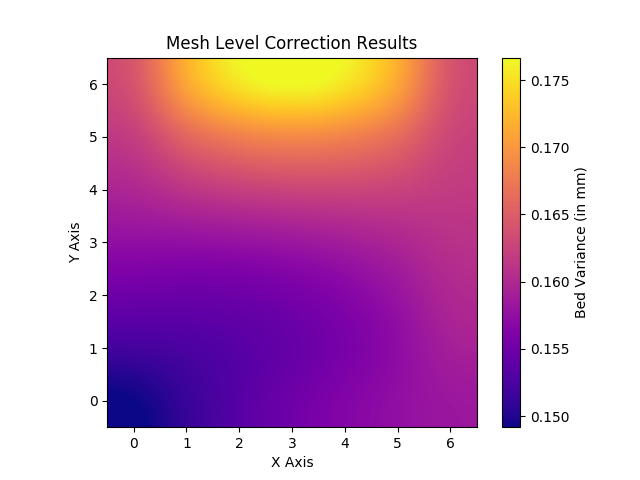

# g81-to-heatmap
This script converts 3D printer "G81" bed mesh level output (Prusa, maybe others) to a heatmap for easy viewing. For example, your printer may output the following with G81:

```
  0.16417  0.17111  0.17528  0.17667  0.17528  0.17111  0.16417
  0.16213  0.16579  0.16805  0.16889  0.16832  0.16635  0.16296
  0.15991  0.16129  0.16224  0.16278  0.16289  0.16258  0.16185
  0.15750  0.15759  0.15787  0.15833  0.15898  0.15981  0.16083
  0.15491  0.15471  0.15493  0.15556  0.15659  0.15805  0.15991
  0.15213  0.15264  0.15342  0.15444  0.15573  0.15727  0.15907
  0.14917  0.15139  0.15333  0.15500  0.15639  0.15750  0.15833
```

This script will convert that output into something like this:



In the above heatmap, we can more clearly see the current bed situation as well as the potential interactions adjustments may have in those areas.

## Usage
### Prerequisites
To use this script, you will need to install the following Python libraries using **pip** or some other method:

- matplotlib
- numpy

### Getting Your G81 Output
The Prusa i3 MK3 uses **G80** do mesh bed leveling, after which **G81** becomes available to view the mesh bed level status. You will need to do the following:

1. Do a mesh bed level operation by selecting it in your printer's interface or by executing **G80** directly with all of its prereqs, check your printer's documentation.
2. Send a **G81** command to your printer via a tool like Octoprint or Pronterface. For this example we'll use Pronterface, as it's part of Prusa's Slic3r install package. You'll get output similar to the following:

    ```
      0.16417  0.17111  0.17528  0.17667  0.17528  0.17111  0.16417
      0.16213  0.16579  0.16805  0.16889  0.16832  0.16635  0.16296
      0.15991  0.16129  0.16224  0.16278  0.16289  0.16258  0.16185
      0.15750  0.15759  0.15787  0.15833  0.15898  0.15981  0.16083
      0.15491  0.15471  0.15493  0.15556  0.15659  0.15805  0.15991
      0.15213  0.15264  0.15342  0.15444  0.15573  0.15727  0.15907
      0.14917  0.15139  0.15333  0.15500  0.15639  0.15750  0.15833
    ```
3. Copy the above output and place it in the script in the **g81_output_raw** string variable. Note the """ around the block, this will allow you to have a multiline string.
4. Adjust the regex rules underneath to clean this up or replace things as needed. Ultimately, you want the above to become this:

    ```
    0.16417,0.17111,0.17528,0.17667,0.17528,0.17111,0.16417
    0.16213,0.16579,0.16805,0.16889,0.16832,0.16635,0.16296
    0.15991,0.16129,0.16224,0.16278,0.16289,0.16258,0.16185
    0.15750,0.15759,0.15787,0.15833,0.15898,0.15981,0.16083
    0.15491,0.15471,0.15493,0.15556,0.15659,0.15805,0.15991
    0.15213,0.15264,0.15342,0.15444,0.15573,0.15727,0.15907
    0.14917,0.15139,0.15333,0.15500,0.15639,0.15750,0.15833
    ```
    Note: Notice there were two spaces removed from the front of each line as well!
5. Execute the script. If everything goes well you will have a **g81_heatmap.png** in the same directory as the script.

# Enjoy!
